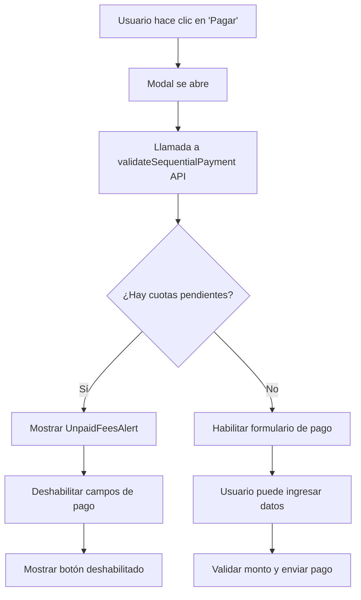

# 🚀 Validación de Pagos Secuenciales - Frontend

## ✨ Nuevas Funcionalidades Implementadas

### 🔒 **Validación Automática de Pagos**

El frontend ahora implementa **validación de pagos secuenciales** para asegurar que los estudiantes paguen sus cuotas en orden cronológico.

#### **Características principales:**

✅ **Validación en tiempo real** - Al abrir el modal de pago, se verifica automáticamente si existen cuotas anteriores pendientes  
✅ **Interfaz intuitiva** - Los campos se deshabilitan automáticamente si no se puede proceder con el pago  
✅ **Alertas informativas** - Muestra claramente qué cuotas están pendientes y por qué no se puede proceder  
✅ **Indicadores visuales** - Las tarjetas muestran advertencias cuando hay cuotas pendientes  
✅ **Mensajes de error mejorados** - Explicaciones claras sobre las políticas de pago

---

## 🛠️ **Componentes Nuevos/Modificados**

### 📁 `src/scene/fees/AddPayment/`

#### **`index.jsx` (Modificado)**

- ✅ Validación automática al abrir el modal
- ✅ Deshabilitación de campos cuando hay cuotas pendientes
- ✅ Validación de montos máximos
- ✅ Manejo mejorado de errores

#### **`UnpaidFeesAlert.jsx` (Nuevo)**

- ✅ Componente que muestra las cuotas pendientes en una tabla
- ✅ Códigos de color para diferentes estados (vencida, por vencer, vigente)
- ✅ Formateo de moneda y fechas
- ✅ Información sobre políticas de pago

### 📁 `src/components/`

#### **`SequentialPaymentWarning.jsx` (Nuevo)**

- ✅ Chip de advertencia para tarjetas con cuotas pendientes
- ✅ Tooltip informativo
- ✅ Diseño responsive y accesible

### 📁 `src/hooks/`

#### **`useFeesStore.js` (Modificado)**

- ✅ `getUnpaidFeesByStudent()` - Obtiene cuotas pendientes de un estudiante
- ✅ `validateSequentialPayment()` - Valida si se puede proceder con un pago
- ✅ `checkStudentUnpaidFees()` - Verificación rápida de cuotas pendientes

#### **`useSequentialPaymentValidation.js` (Nuevo)**

- ✅ Hook personalizado para manejar validaciones
- ✅ Cache de estudiantes con cuotas pendientes
- ✅ Funciones de verificación y limpieza de cache

---

## 🔄 **Flujo de Validación**



---

## 📱 **Experiencia de Usuario**

### **Escenario 1: Pago Normal (Sin cuotas pendientes)**

1. Usuario hace clic en "Pagar cuota"
2. Modal se abre con loading spinner (validando...)
3. Campos se habilitan automáticamente
4. Usuario ingresa datos y procede con el pago

### **Escenario 2: Cuotas Pendientes**

1. Usuario hace clic en "Pagar cuota"
2. Modal se abre con loading spinner
3. Se muestra alerta roja con tabla de cuotas pendientes
4. Campos quedan deshabilitados
5. Botón de pago se deshabilita con texto explicativo

### **Escenario 3: Error de Validación**

1. Si hay error en la API, se muestra mensaje genérico
2. Campos se deshabilitan por seguridad
3. Usuario puede cerrar y reintentar

---

## 🎨 **Mejoras Visuales**

### **Alertas y Notificaciones**

- ⚠️ Alert component con severidad "warning" para cuotas pendientes
- 📊 Tabla organizada con información de cuotas
- 🎨 Chips con colores según estado (vencida, vigente, etc.)
- 💡 Tooltip explicativo sobre políticas de pago

### **Estados de Formulario**

- 🔒 Campos deshabilitados con estilos coherentes
- ⏳ Loading states con spinners
- ✅ Botones que cambian dinámicamente (contained/outlined)
- 📝 Helper text con información contextual

### **Responsive Design**

- 📱 Modal funciona correctamente en móviles
- 📊 Tabla responsive para cuotas pendientes
- 🎯 Chips y tooltips adaptativos

---

## 🔧 **Configuración de API**

### **Nuevos Endpoints Utilizados**

```javascript
// Validar pago secuencial
GET / fees / student / { studentId } / validate - payment / { feeId };

// Obtener cuotas pendientes
GET / fees / student / { studentId } / unpaid;
```

### **Estructura de Respuesta**

```javascript
// validateSequentialPayment response
{
  "isValid": false,
  "message": "No se puede pagar la cuota de Agosto 2025...",
  "unpaidFees": [
    {
      "id": 1,
      "month": 7,
      "year": 2025,
      "monthName": "Julio",
      "value": 15000,
      "amountPaid": 0,
      "remainingAmount": 15000,
      "startDate": "2025-07-11",
      "endDate": "2025-08-10"
    }
  ]
}
```

---

## 🚀 **Para Probar las Funcionalidades**

1. **Ejecutar el backend** con las nuevas validaciones
2. **Crear estudiantes** con cuotas en el seed
3. **Intentar pagar una cuota futura** sin haber pagado las anteriores
4. **Observar las validaciones** y mensajes informativos
5. **Pagar las cuotas en orden** para ver el flujo completo

---

## 🔮 **Próximas Mejoras Sugeridas**

- 🔔 **Notificaciones push** cuando se resuelven cuotas pendientes
- 📈 **Dashboard de estado** de cuotas por estudiante
- 💳 **Planes de pago** para cuotas vencidas
- 📊 **Reportes** de cuotas pendientes por período
- 🤖 **Recordatorios automáticos** por email/SMS

---

## 📞 **Soporte**

Si encuentras algún problema con las validaciones:

1. Verifica que el backend esté ejecutándose
2. Revisa la consola del navegador para errores
3. Confirma que los endpoints de validación respondan correctamente
4. Verifica que los datos del estudiante estén correctos en la base de datos
